<<<<<<< HEAD
# reefnexus

## Overview
Although there are many fish databases available, there are few applications that quickly lets an individual observe the reef fish ecology occurring in their local area.  Reef Nexus is a crowd-sourced application aimed towards divers and fishermen which stores the location of fish species, based on a user's own encounter/knowledge with that particular species.  The initial application will survey the Hawaiian Islands, and the database will have a full list of Hawaiian reef fish.  A user can create an account where they can choose and store a list of fishes they have encountered and the location of where they encountered them.  It will be saved in their own list for reference.  Those without accounts can enter a species location, but they will not be able to save a list.

The main page will contain a map of a default location (Oahu for now) or the user's current location.  Each location will have statistics on the abundance of various fish based on the information provided by site users.  These will be the most basic functions of the website, and will be the main focus.

Extended functions include users contributing their own data on species of fish not already included in the database, and perhaps their own individual maps of personal encounters.

Possible issues include temporal change in fish locations and incorrect information (spamming, etc.), although reef species tend to be static, and entries will be moderated by administrators.

The ultimate goal of the application is to provide ocean-enthusiasts with information on the abundance of various fish species in a specific area, so they have an idea of what they will encounter.  This will give snorkelers, divers, and fishermen a good idea of where to find species of interest.  The database will also offer detailed information for each fish, along with their abundance for all areas in which they occur in.  

## Approach
The core components for this application, at least for the first deliverable, will be the map and reef fish database.  For the map, we will be utilizing the Google Maps JavaScript API, and integrating it within our application so that we will be able to map the coastal areas of the island to specific names.  When a user clicks in a defined area on the map, a description will be provided with a list of fish species, and a user will be able to add a fish that they have spotted to this location.  A user can also choose not to click on a specific location, and instead have the app geolocation function automatically detect where they are.  This is useful for on-the-go fish adding, or if the user do not know their current location.

The exact calculation for abundance ratings for each fish is still being considered, but for now it will be a percentage termed "sighting rate", and will be based on the number of times seen by users compared to other fishes in the area.  Each location will have sighting rates independent of other locations.  

As for the reef fish database, it will contain a good amount of common reef fish, and there will be a detailed description with each species along with areas that they were sighted in, along with their respective sighting rates for each area.  At least for the first deliverable, this database will be limited to Hawaiian species.  

A login system will be implemented where users can view the fishes that they have sighted themselves.  Although right now the options are limited for members, there will be communal features added that will make the application more community friendly.  These options are discussed in the deliverables.

## Deliverable 1
Users will be able to add to the database of where they saw a particular fish.  In the fish database, the user will be able to search for a fish given certain parameters.  A second main functionality is given a user-specified area or their current location (For the first deliverable, the area is limited to Oahu), our application will be able to display the fish found at that location and its sighting rate.  Users will also have an option to register a member and sign in to review their personal sightings and see a record of their recent activity.  

## Deliverable 2
Users will be able to add a picture of a fish, and if a name is not specified for the fish, then other members of the community will be able to review and identify the fish for the database.  Members of the site will also be allowed to add a new species of fish to the database should the database not already contain that species.  

## Deliverable 3
These functionalities were suggested by Dr. Johnson:

Pick-a-fish UI:   Swipe through fish pictures, tap the one that resembles the one you just saw.

Describe-a-fish UI:  Textually enter a description of the fish, others can annotate with the identification.

Snap-a-fish UI:  Take a picture of the fish, upload it. If the image file has geo-location and time data, extract and automatically annotate the entry with time of viewing and location.

## Mockup

Currently unavailable: User's fish collection

Home Page:
This page offers the main feature of viewing fish sighting rates for a user's current location.  Clicking on the map or having the GPS find your location will list the details on the right pane.  Additionally, the obnoxious add button will allow users to add fish they have sighted at the current location.  

Home Page (Desktop View)

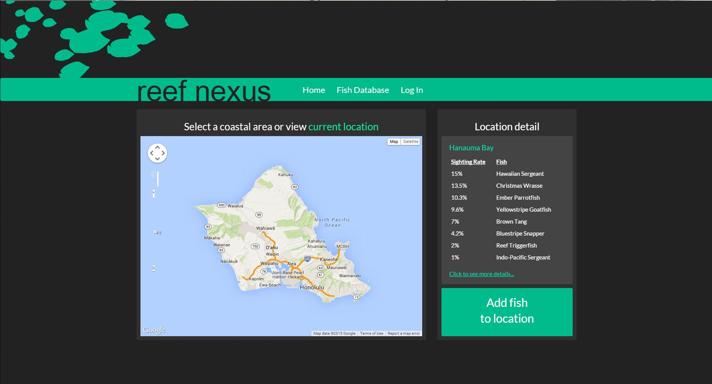

Home Page (Mobile View)

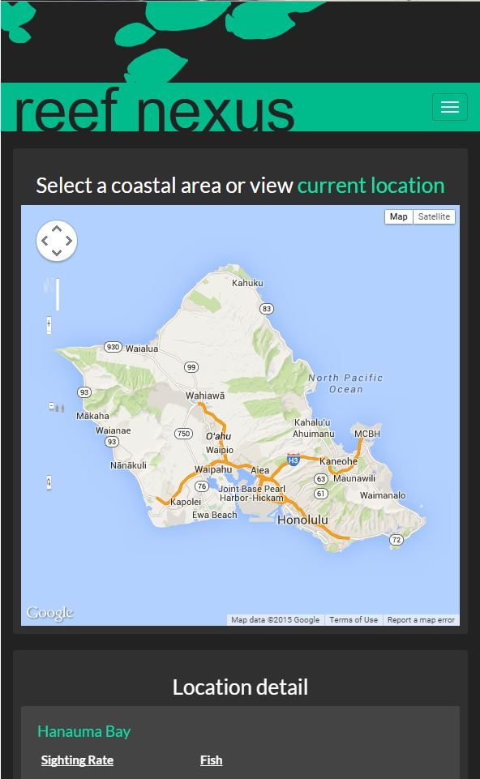

Location Database Page:
This page will provide detailed information on each location, and users will be directed here from the home page if they decide to view more details.  Clicking on the button "view more details" will extend the list of fish species.  By default, the top ten most abundant species will show on the page.  There will also be a search function on this page for locations (currently unavailable).

Note: The "Location Database" is present in the following navbar, but since it is the latest addition it is not present in the previous screenshots.

Location Database (Desktop View)

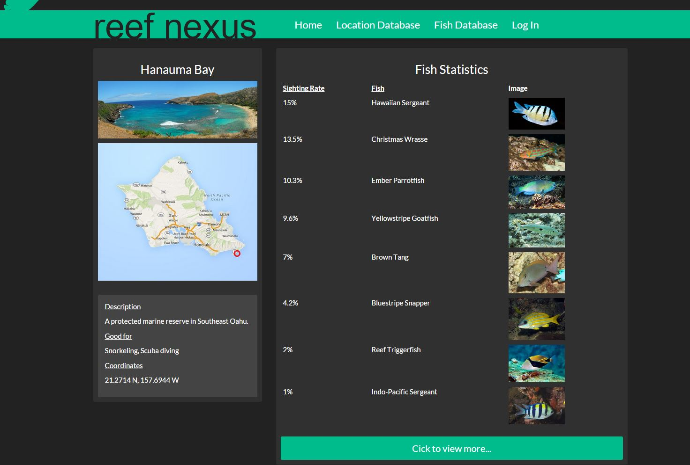

Location Database (Mobile View)

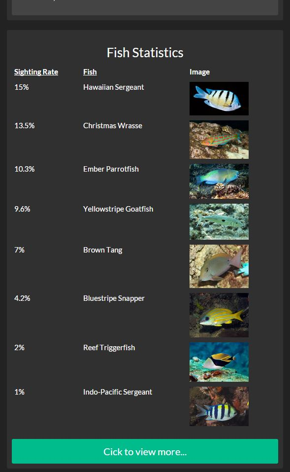

Add Fish Page:
The add fish function brings the user to this page, which requires several parameters.  First is the location, which will automatically be filled out if the user started from the home page.  The second parameter is the fish species itself, and there will be autocomplete so users will actively see a list of fish according to what they type in (common name and scientific name).  The third function will be for users who want to add a picture of the fish they sighted.  If a user cannot identify the fish, they can add a picture which will be available for others to see and confirm on the database page.

Add Fish Page (Desktop View)

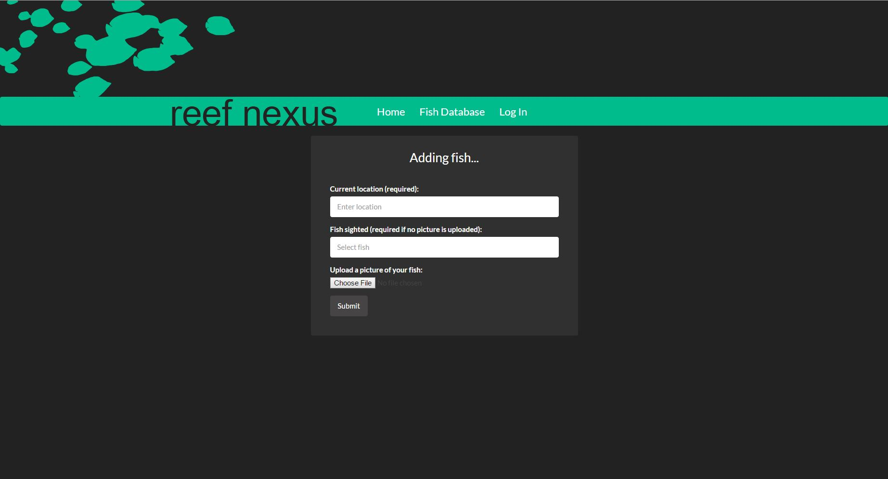

Add Fish Page (Mobile View)

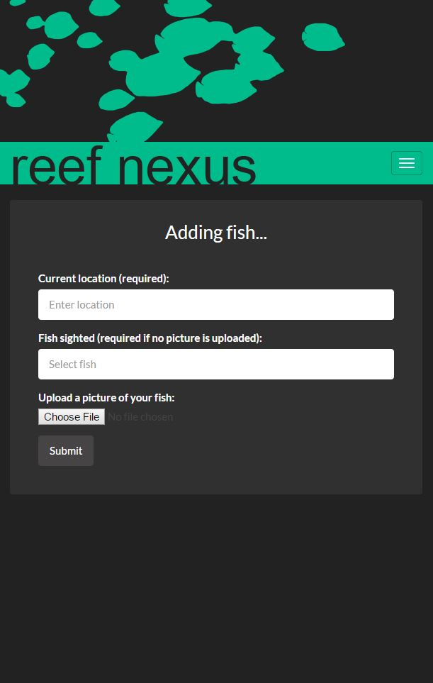

Database Page: 
This page will allow users to search for fish in the database.  As of now, the available parameters will be common name, scientific name, family name, and location.  A second informational pane on the page will contain a list of fish that are currently unidentified but were seen by others.  Users will have the option to identify the fish should they know it.

Database Page (Desktop View)

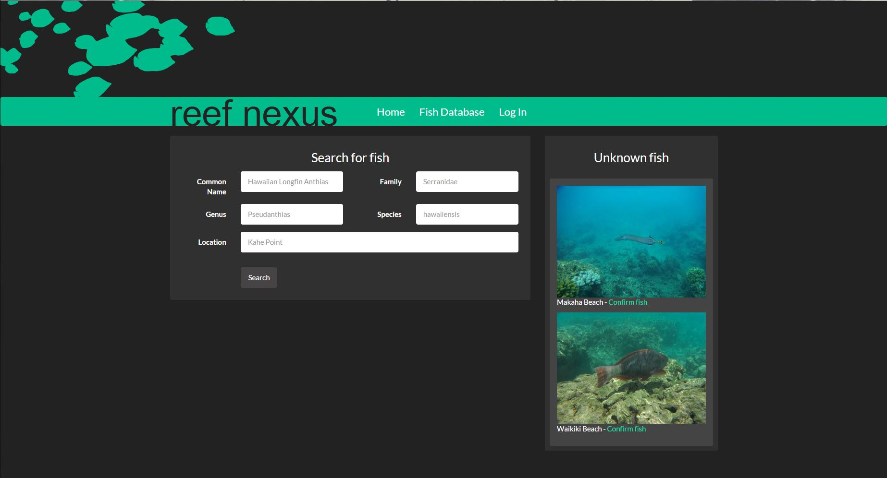

Database Page (Mobile View)

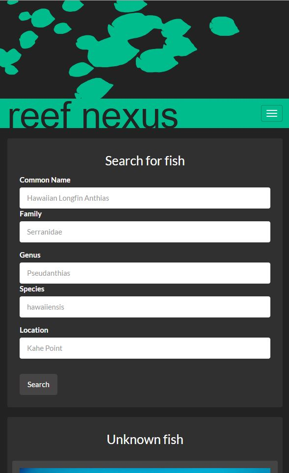

Login Page:
Page where members can log in and complete various tasks and observe their recent activity.

Login Page (Desktop View)

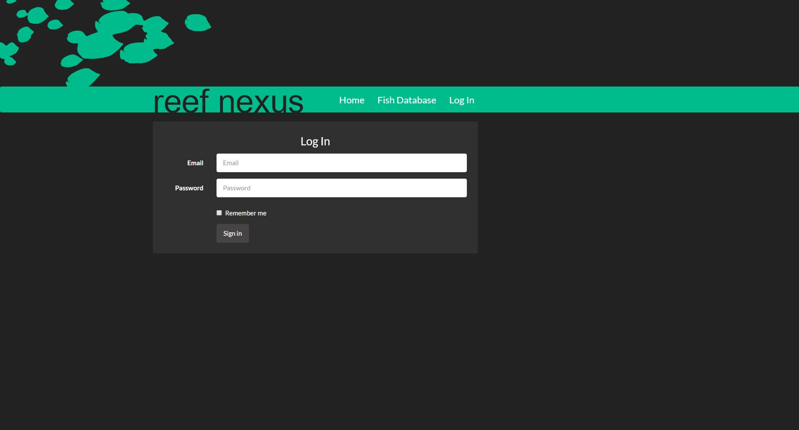

Login Page (Mobile View)

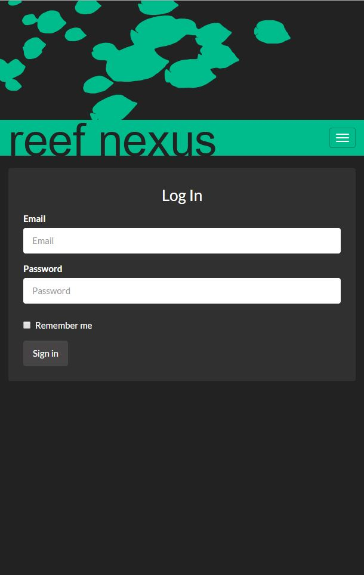

User Page:
This is the page users are greeted with when they log in.  Available tasks are listed in the left pane, whereas recent activity by the user will be presented in the middle-right pane.  One of the main draws for a user to register as a member is to view the fish that they have added themselves, so they may be able to reference them later.  Many of the later deliverables will add user features that will be listed on this page.  

User Page (Desktop View)

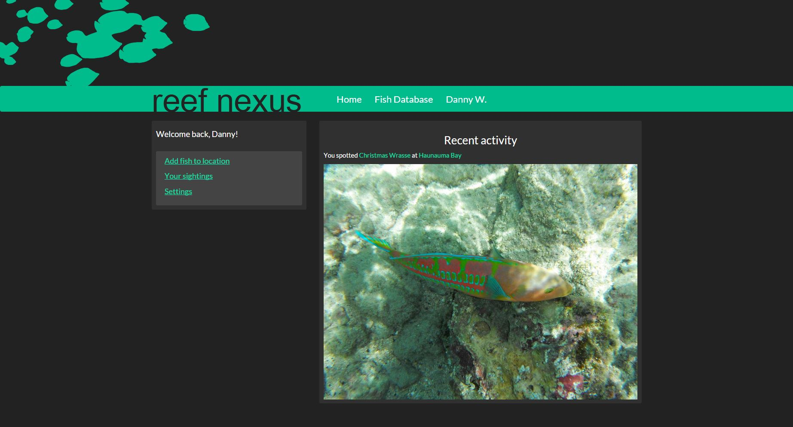

User Page (Mobile View)

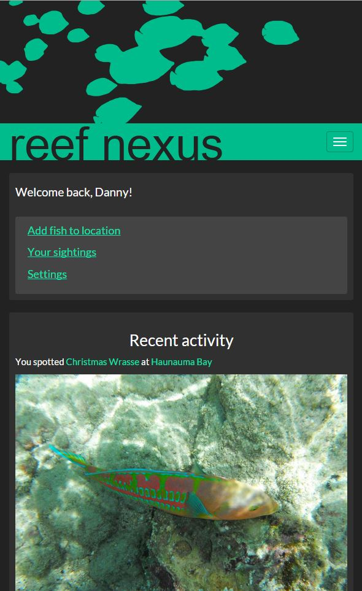
=======
# ics-play-bootstrap

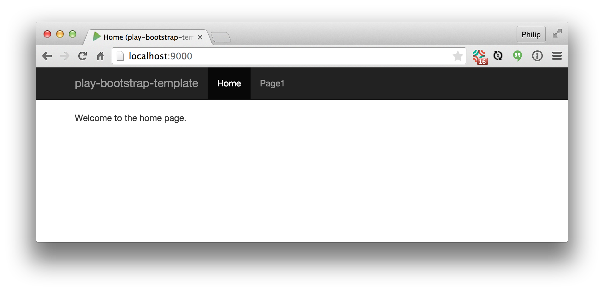

## Overview

This is a revised version of the Activator 'play-java' template system which:

  * Conforms to the ICS software engineering coding standards

  * Illustrates how to incorporate Twitter Bootstrap 3 into Play.

To use it, first create an empty GitHub repo and clone to your desktop.

Next, cd into your new repo and set ics-play-bootstrap as the upstream master:

    git remote add upstream https://github.com/ics613s15/ics-play-bootstrap.git

Next, merge the contents of ics-play-bootstrap into your new empty repo:

    git fetch upstream
    git merge upstream/master

Now your repo will contain the ics-play-bootstrap repo.

Edit the build.sbt file to change the name to your new project.

## Features

ics-play-bootstrap provides the following features:

  * Modifications to the "play-java" Activator template to eliminate checkstyle errors.

  * Rename view files to be capitalized (i.e. Index.scala.html, not index.scala.html). This is so that the Java class generated by these templates are capitalized, conforming to standard Java practice.

  * Modifications to [Main.scala.html](https://github.com/ics613s15/ics-play-bootstrap/blob/master/app/views/Main.scala.html) template to load [Twitter Bootstrap 3](http://getbootstrap.com/) files using CDN sites.

  * Modifications to illustrate simple page navigation through changes to the [controller](https://github.com/ics613s15/ics-play-bootstrap/blob/master/app/controllers/Application.java), [routes](https://github.com/ics613s15/ics-play-bootstrap/blob/master/conf/routes), and [view](https://github.com/ics613s15/ics-play-bootstrap/tree/master/app/views) files.

  * The [navbar](https://github.com/ics613s15/ics-play-bootstrap/blob/master/app/views/Main.scala.html) highlights the current active page through a parameter passed from the controller.

  * The [main.css](https://github.com/ics613s15/ics-play-bootstrap/blob/master/public/stylesheets/main.css) adjusts body padding due to the use of the fixed-top navbar.

  * Support for simple [tests](https://github.com/ics613s15/ics-play-bootstrap/blob/master/test/test/IntegrationTest.java).

## Screencast

A short screencast containing a walkthrough of these features is available here.

## Version information

Play 2.3.7, Bootstrap 3.3.2

>>>>>>> upstream/master
