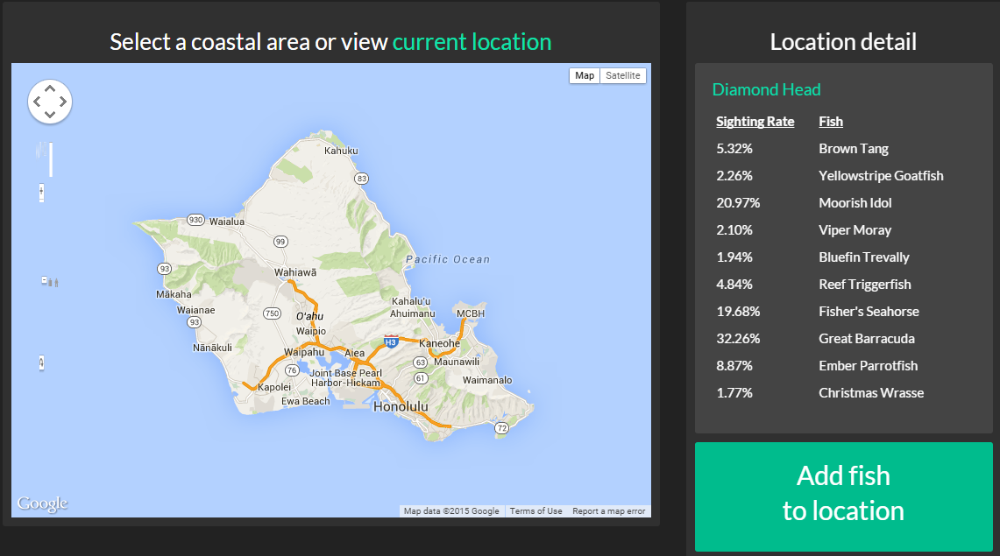

#reef nexus

<b>Reef Nexus</b> is a web application that offers insight on the relative occurrence of fish species within various locations.  Targeted towards ocean enthusiasts, the application takes crowd-sourced information to provide these censuses.  When users observe a particular fish species in an area, they can report the sighting to Reef Nexus where it will be contributed to the sighting rate in that area.  Within each locale in Reef Nexus, users can view the most commonly sighted fish species, and also fishes that do not occur frequently.

<b>Reef Nexus is built upon:</b>
- <a href="https://www.playframework.com/">Play Framework 2.3.8</a>
- <a href="http://getbootstrap.com/2.3.2/">Twitter Bootstrap</a>
- <a href="https://www.heroku.com/">Deployed on Heroku</a>

<b>Additional features:</b>
- Comprehensive fish database which includes species-specific information 
- Option for users to log in to add and view their own sightings

<b>Features to be implemented:</b>
- An easy identification feature which allows users to easily identify a fish which they cannot
- Ability for other users to identify an unidentified fish

<b>The application is currently being demoed within the main Hawaiian Islands</b>

##Documentation and Useful Links
- <a href="https://www.reefnexus.com">Reef Nexus Application</a>
- <a href="https://github.com/wengdg/reefnexus/wiki/Developer-Guide">Developer Guide</a>
- <a href="https://github.com/wengdg/reefnexus/wiki/User-Guide">Navigating Reef Nexus</a>

##Contributing and Contact
- Please submit issues or improvements to the <a href="https://github.com/wengdg/reefnexus/issues">Reef Nexus issues page</a>. 

##Licenses
- Reef Nexus is licensed under the <a href="https://www.apache.org/licenses/LICENSE-2.0">Apache 2.0</a> license.
